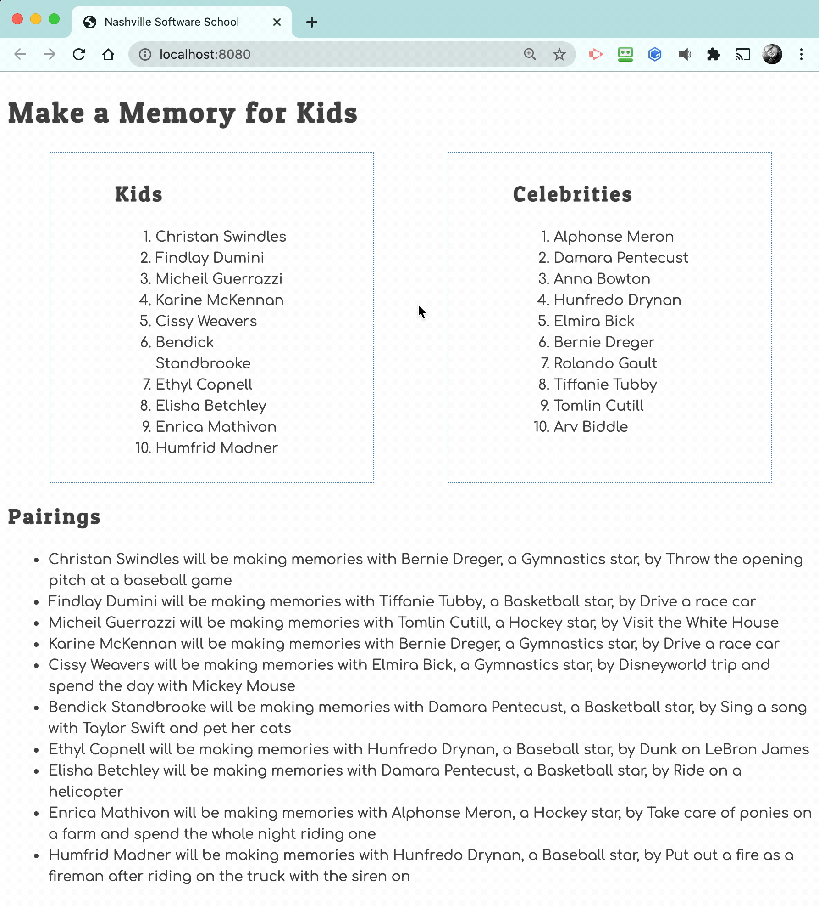

# Events and Debugging Assessment

Time to assess how well you have learned to use the debugging tools in Chrome Dev Tools, and writing click event listeners. This application is to show kids with illnesses and the memories the would like to make. Celebrities sign up to help kids make memories.

> 🧨 Make sure you answer the vocabulary and understanding questions at the end of this document before notifying your coaches that you are done with the project

## Event Listeners to Create

1. When the kid name is clicked, it should display their wish.
1. When the celebrity name is clicked, it should display their sport.
1. The pairings list should should contain the pairing in the following format.
    ```html
    {child name} will be making memories with {celebrity name}, a {celebrity sport} star, by {child wish}
    ```

Below is an animation showing how the application should look when complete and how the event listeners should work.



## Setup

Your instruction team will provide a link for you to create your assessment repository. Once your repo is created, clone it to your machine.

1. Make sure you are in your `workspace` directory.
1. `git clone {github repo SSH string}`.
1. `cd` into the directory it creates.
1. `code .` to open the project code.
1. Use the `serve` command to start the web server.
1. Open the URL provided in Chrome.

Make sure your Developer Tools are open at all times while working on this project. Use the messages provided in the Console to determine what code needs to be fixed or implemented, and use breakpoints in the Sources tab to step through your code as you debug.

## Vocabulary and Understanding

Before you click the "Complete Assessment" button on the Learning Platform, add your answers below each question and make a commit.

1. When a child is clicked on in the browser, which module contains the code that will execute on that event happening? Can you explain the algorithm of that logic?
   > the Kids.js module contains the code that executes the click event. The event listener detects when a child element is clicked on in the browser and the algorithm looks at the data-type of the child clicked. It then gets the child's id and wish via the data-id and data-wish attributes. It then searches the children array for the matching child object and an alert is displayed showing the child's name and their wish in the alert window.

2. In the **Pairings** module, why must the `findCelebrityMatch()` function be invoked inside the `for..of` loop that iterates the kids array?
   > It has to be invoked inside the for..of loop because each child needs to be matched with their celebrity based on their celebrityId. If you did this outside the loop it would give you just one match I believe.

3. In the **CelebrityList** module, can you describe how the name of the sport that the celebrity plays can be displayed in the window alert text?
   > The name of the sport that the celebrity plays can be displayed in the window alert by accessing the data-sport attribute from the clicked element. That element hold the sport name in the variable.

4. Can you describe, in detail, the algorithm that is in the `main` module?
   > document.querySelector("#container) is a method that targets the first element in the DOM with the id #container and then we are setting it as the definition to the mainContainer variable. the applicationHTML variable is defined as a string of the HTML that is being rendered into the DOM. at the innerHTML of the id #container on the index.html we are inserting this string into there effectively rebuilding the DOM with everything defined inside the applicationHTML variable. 
